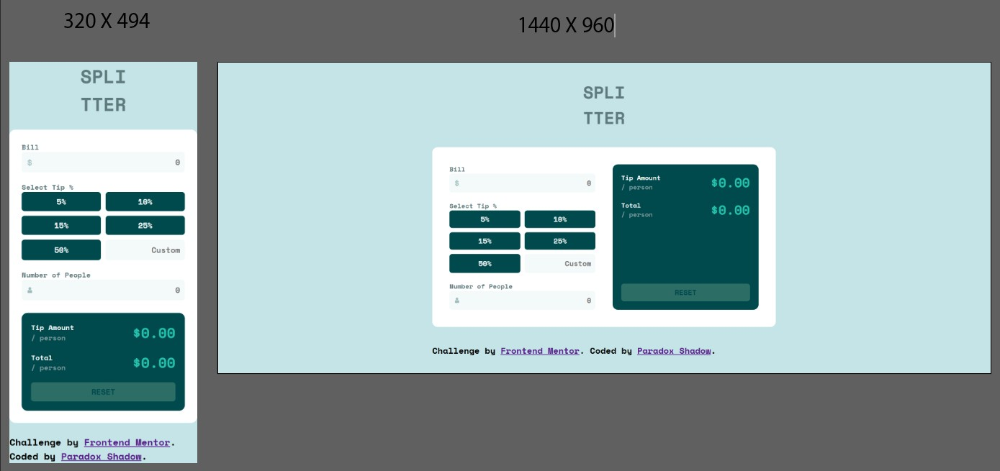

# Frontend Mentor - Tip calculator app solution

This is a solution to the [Tip calculator app challenge on Frontend Mentor](https://www.frontendmentor.io/challenges/tip-calculator-app-ugJNGbJUX). Frontend Mentor challenges help you improve your coding skills by building realistic projects.

## Table of contents

- [Overview](#overview)
  - [The challenge](#the-challenge)
  - [Screenshot](#screenshot)
  - [Links](#links)
- [My process](#my-process)
  - [Built with](#built-with)
  - [What I learned](#what-i-learned)
  - [Continued development](#continued-development)
  - [Useful resources](#useful-resources)
- [Author](#author)
- [Acknowledgments](#acknowledgments)

## Overview

### The challenge

Users should be able to:

- View the optimal layout for the app depending on their device's screen size
- See hover states for all interactive elements on the page
- Calculate the correct tip and total cost of the bill per person

### Screenshot



### Links

- Solution URL: [Solution URL](https://github.com/Taresta/Tip-Calculator-App.git)
- Live Site URL: [Live Site URL](https://taresta.github.io/Tip-Calculator-App/)

## My process

### Built with

- Semantic HTML5 markup
- SASS custom properties
- Flexbox
- CSS Grid
- Mobile-first workflow

### What I learned
Well, to be honest, this project was difficult. Maybe not so much the problem-solving part, but the part about making it clean and less redundant. I tried my best to practice my refactoring skills here, and that was not easy. I felt stuck a lot of time when I tried to think of simpler ways to do things. Try to break down my functions into smaller parts wherever I could and tried to use pure functions. I am not sure if the effort paid off, but I did learn many things through this project. 
Let me mention the design first. 
1. In my sass code, this is the first time I used mixins without any help. 
2. I also learnt that the mystery behind the orange border that keeps on popping up whenver I selected any input element. I had a guess that this was the default style of the browser but I thought the culprit was the border property, but after no getting it right multiple times, I found out it was the outline that I needed to overwrite.
```scss
 outline: 1.5px solid $strong-cyan;
```
3. I believe I have used grid multiple times now, but I always forget the working behind the fraction unit. If we set up grid-template-columns using 1fr 1fr, something like that. This means we are distributing extra space equally between columns, not setting them up to be of equak width. They can be of equal width, but by just doing this it is not guaranteed. To be 100% sure we should use something like this.
```scss
grid-template-columns:repeat(2, minmax(0, 1fr));
```
The above code would create two columns of equal width, whose minimum width can drop down to 0 and max width is 1fr. This would ensure both of them are of equal width.
4. One more observation is that when we use place-content:center for a grid container, it would place the columns and rows in the center and not let them stretch up to the width and the height of the container. I think this way way the columns and the rows would be only wide and tall enough to contain the content and that saved me a lot of trouble to avoid setting media queries between 320px and 768px because the main element stopeed growing in width automatically after a certain width.
```scss
display:grid;
place-content: center;
```
Now, let us talk about javascript. I do not know where to even start for this one. Either what I have done is a big mess or maybe it is not too bad and I can still be saved 🥲.
1. Ok, so the first big decision was to use the class splitBill to encapsulate the logic of this Tip-Calculator-APP. In this class I defined bill, people and tip, and defined the logic for calculating total/person and totalTip/person.
```jss
class SplitBill {}
```
2. The secong bigg decision was to use objects for validations, for displaying and clearing errors. I do not know if it is good but I did feel like keeping all the similar code in one object does look clean and it is better than using a lot of if-else statements.
```jss
const validations = {
    bill: (bill) => isNumber(bill, 'bill') && isGreaterThanZero(bill, 'bill'),
    people: (people) => isNumber(people, 'people') && isInteger(people, 'people') && isGreaterThanZero(people, 'people'),
    tip: (tip) => isNumber(tip, 'tip') && tip >= 0
};
```
3. Next comes the part of keeping my functions short and using pure function. I do not know if I have succeeded in the latter. I know a pure function is the one that would always generate the same output for the same input, and it does not rely on any outer variables. I guess since this is still my first time, so it is okay even if I was not able to fully achieve that. I would get a lit of opportunities to practice this in the future projects.

### Continued development

I have already said a lot in the above section, So, I will keep it a bit short here. I have still a lot to learn about refactoring, and using good practices. I hope every challenge will be a step towards this direction.

### Useful resources

- [Refactoring your code](https://www.frontendmentor.io/learning-paths/javascript-fundamentals-oR7g6-mTZ-/steps/66d537703c19191dc3bc0d36/article/read) - I referred back to this article multiple times. It is very helpful and it also provides links to other use articles that explain a lot about refactoring.
- [MDN](https://developer.mozilla.org/en-US/) - I can not do without this in any project. It is the number one documentation one can ever find.


## Author

- Website - [Paradox/Taresta](https://github.com/Taresta)
- Frontend Mentor - [Paradox](https://www.frontendmentor.io/profile/Taresta)

## Acknowledgments

Thank you Frontend Mentor for this challenge and thanks to all the good resources out there.
